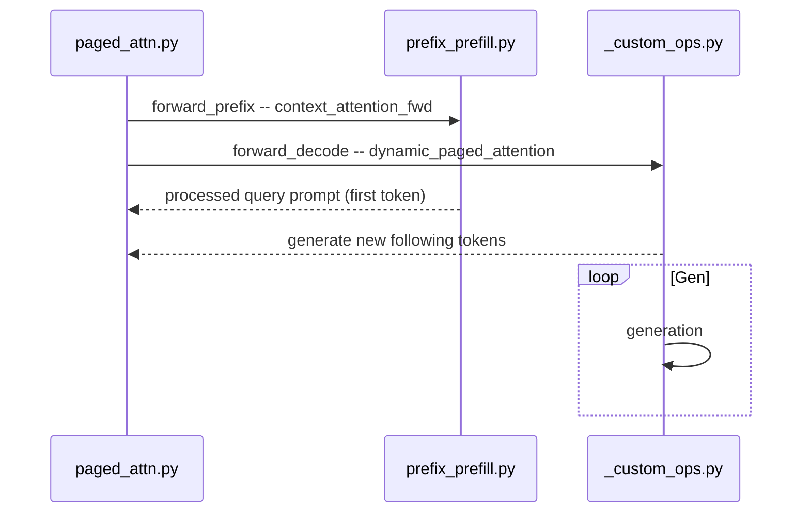

# Design

### Prefill

When device capability >= 80, block size is 128, otherwise 64.

When fp32, reduce block size due to limited GPU Shared memory.

Then we compute `grid`, i.e., the number of kernel instances that run in parallel.
