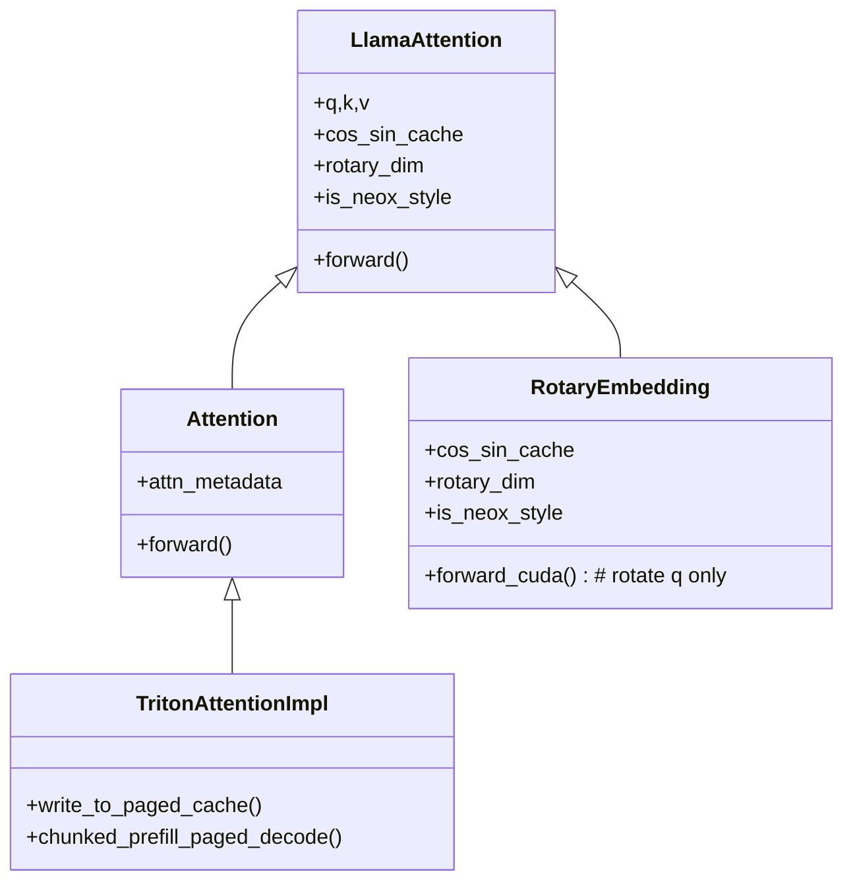

# Lazy-Attention

This repo is a minimal implementation of LazyAttention over vLLM.

We use monkeypatch to replace the original function/class in vLLM with our customized version.

For C/CUDA code, we use `#include` macro to inject the customized code into the original code.

## Top-down

1. We feed one request consisting of
   - documents
   - query
   - sampling params

2. each request is processed as a whole body, it will check if the documents are prefilled, if not find the part has not been cached and compute (**core diff** from prefix cache)

3. after we find that the prefix is processed, continue decoding

4. kv cache manager, 


## Benchmark and profiler


## Test coverage

- [x] llama attention
- [x] triton attention backend
  - [x] prefix prefill
  - [x] paged decoding
- [x] scheduler
- [x] kv cache manager

## Organization

- `drag/`: the main implementation of Dynamic RAG.
- `drag/tests/`: the unit tests for Dynamic RAG.
- `drag/rotary_embedding.py`: the implementation of customized rotary embedding.
- `drag/llama.py`: the implementation of customized llama model.
- `drag/attention/backends/triton_attn.py`: the implementation of customized attention layer.


- `csrc/`: the customized CPP/CUDA code. We only inject a customized rotary embedding kernel into the original code. While the original code always rotate the key and query, we only rotate the query and keep the key unchanged.

# Build

```shell
module load cuda/12.4.0
conda install ccache
CCACHE_NOHASHDIR="true" pip install --no-build-isolation -e .
```


## Design




## Appendix

AttentionMetadata is built in [gpu_model_runner.py](../vllm/v1/worker/gpu_model_runner.py).

```python
        attn_metadata = self.attn_metadata_builder.build(
            num_reqs=num_reqs,
            num_actual_tokens=total_num_scheduled_tokens,
            max_query_len=max_num_scheduled_tokens,
            common_prefix_len=common_prefix_len,
        )
```


```bash
cmake .. \
    -G Ninja \
    -DCMAKE_INSTALL_PREFIX=.. \
    -DCMAKE_BUILD_TYPE=RelWithDebInfo \
    -DVLLM_TARGET_DEVICE=cuda \
    -DCMAKE_C_COMPILER_LAUNCHER=ccache \
    -DCMAKE_CXX_COMPILER_LAUNCHER=ccache \
    -DCMAKE_CUDA_COMPILER_LAUNCHER=ccache \
    -DCMAKE_HIP_COMPILER_LAUNCHER=ccache \
    -DVLLM_PYTHON_EXECUTABLE=$(which python) \
    -DVLLM_PYTHON_PATH=$(python -c "import sys; print(':'.join(sys.path))") \
    -DFETCHCONTENT_BASE_DIR=$(pwd)/../.deps \
    -DNVCC_THREADS=16 \
    -DCMAKE_JOB_POOL_COMPILE:STRING=compile \
    -DCMAKE_JOB_POOLS:STRING=compile=16


cmake --build . --target _C _vllm_fa2_C  # fa3 easy to OOM


cmake --install . --component _C
cmake --install . --component _vllm_fa2_C

cd ..
cp -r vllm_flash_attn ./vllm/

NO_C=1 pip install -e . --no-build-isolation

```

## Block reuse

bug:

request 1

| block 1 | block 2| -> processed
            'doc 1'


request 2

| block 1' | block 2 (reused) not wanted |
             'doc 2'


## Appendix

Details

- [ ] attention
  - [ ] backends
    - [x] flash_attn.py: add extra request metadata for lazy attention
    - [x] triton_attn.py: pass rotary basis and extra request metadata for lazy attention
  - [x] layer.py: customized attention function with rotary basis
- [ ] core
  - [ ] sched
    - [x] output.py: the output from scheduler, only new req data is changed