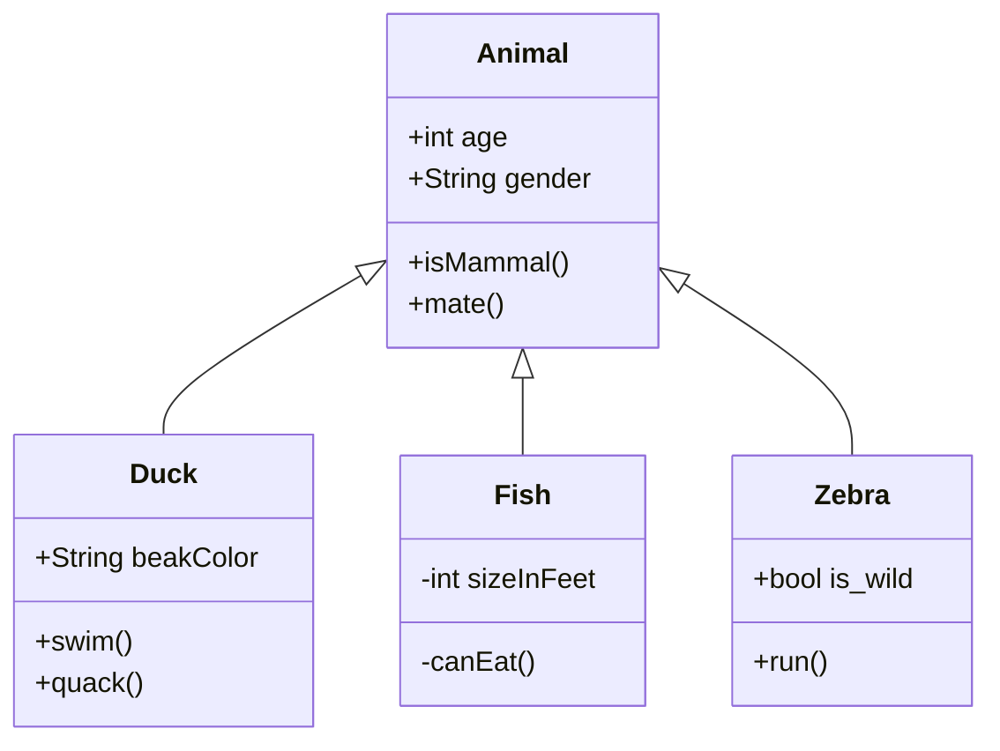

# Minimal Dynamic RAG

This repo is a minimal implementation of Dynamic RAG.

We use monkeypatch to replace the original function/class in vLLM with our customized version.

For C/CUDA code, we use `#include` macro to inject the customized code into the original code.

## Organization

- `drag/`: the main implementation of Dynamic RAG.
- `drag/tests/`: the unit tests for Dynamic RAG.
- `drag/rotary_embedding.py`: the implementation of customized rotary embedding.
- `drag/llama.py`: the implementation of customized llama model.
- `drag/attention/backends/triton_attn.py`: the implementation of customized attention layer.


- `csrc/`: the customized CPP/CUDA code. We only inject a customized rotary embedding kernel into the original code. While the original code always rotate the key and query, we only rotate the query and keep the key unchanged.

# Build

```shell
module load cuda/12.4.0
conda install ccache
CCACHE_NOHASHDIR="true" pip install --no-build-isolation -e .
```


## Design


